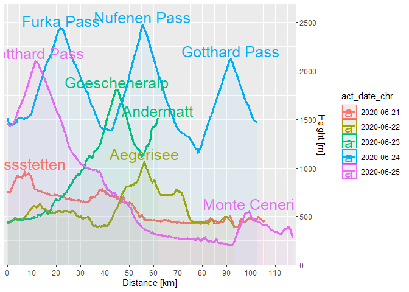
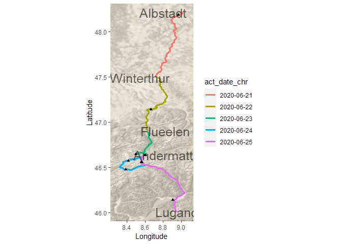
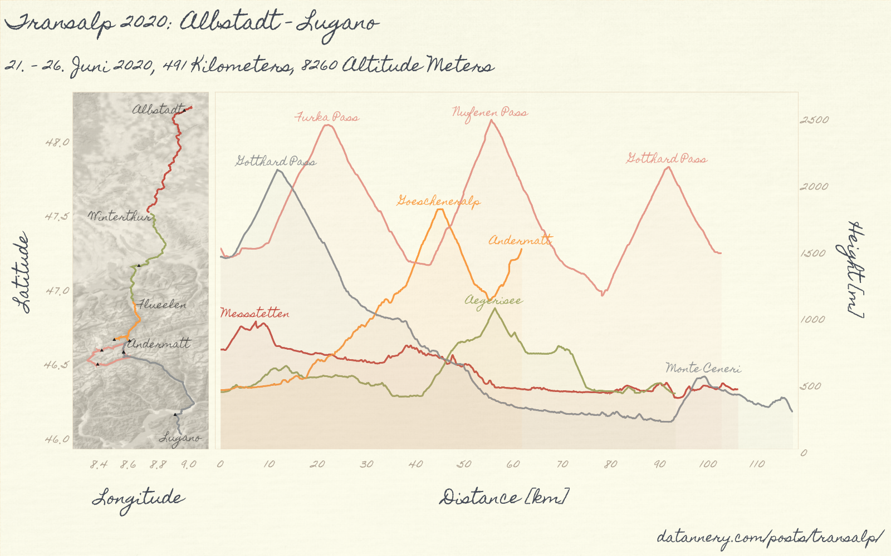

This summer I crossed the alps with my road bike. I’ve recorded the
whole ride and as a nice memory, I would like to visualise this ride.

A short time ago I’ve discovered the awesome R package `targets`. The
use of this package transformed the way I do my analysis and it helps me
to make my post more reproducible.

If you want to reproduce this analysis, you have to perform the
following steps:

-   Install at least R 4.1.0 (use of the new base pipe)
-   Clone the [repository](https://github.com/duju211/transalp)
-   Install the packages in the `libraries.R` file
-   Run targets pipeline with `targets::tar_make()`

# Data

I will describe the most important steps of the analysis in more detail.

At first, load the necessary libraries:

    library(ggpomological)
    library(tarchetypes)
    library(conflicted)
    library(patchwork)
    library(tidyverse)
    library(lubridate)
    library(ggridges)
    library(ggrepel)
    library(targets)
    library(scales)
    library(ggmap)
    library(sf)
    library(fs)

    conflict_prefer("filter", "dplyr")

Load raw data from `rds` file data/df\_act\_meas.rds.

    read_data <- function(act_meas_path) {
      read_rds(act_meas_path)
    }

    ## # A tibble: 90,917 x 13
    ##    id      moving velocity_smooth grade_smooth distance altitude heartrate  time
    ##    <chr>   <lgl>            <dbl>        <dbl>    <dbl>    <dbl>     <int> <int>
    ##  1 366972~ FALSE              0            0        0      1452.        NA     0
    ##  2 366972~ FALSE              0            0        0.9    1446         NA   412
    ##  3 366972~ TRUE               0          -44.6      4.6    1446         NA   413
    ##  4 366972~ TRUE               0            1.4      8.4    1446         NA   414
    ##  5 366972~ TRUE               0            2.8     12.1    1446.        NA   415
    ##  6 366972~ TRUE               0            2.8     15.6    1446.        NA   416
    ##  7 366972~ TRUE               0            1.4     19.1    1446.        NA   417
    ##  8 366972~ TRUE               3.6          1.4     22.5    1446.        NA   418
    ##  9 366972~ TRUE               3.5          0       26      1446.        NA   419
    ## 10 366972~ TRUE               3.5          1.6     29.5    1446.        NA   420
    ## # ... with 90,907 more rows, and 5 more variables: cadence <int>, watts <int>,
    ## #   lat <dbl>, lng <dbl>, act_date <date>

# Preprocessing

Look at the first function:

    pre_process_meas <- function(df_act_meas) {
      df_act_meas |>
        arrange(act_date, time) |>
        mutate(
          act_date_chr = as.character(act_date),
          altitude_norm = altitude / max(altitude),
          row_nr = row_number()) |>
        group_by(id) |>
        mutate(
          distance = distance / 1000,
          distance_norm = distance / max(distance)) |>
        ungroup()
    }

The function does some basic preprocessing on the included activities:

-   Turn activity date into character (for easier plotting)
-   Normalize altitude and distance

Nest the data frame by `id` and `act_date_chr`. Create a new `sf` column
with the geospatial information of the activities:

    convert_to_sf <- function(df_act_meas) {
      df_act_meas |>
        nest(act_data = -c(id, act_date_chr)) |>
        mutate(
          line = map(
            act_data,
            ~ st_linestring(as.matrix(.x[, c("lng", "lat", "altitude")]))),
          geom = map(line, st_sfc, crs = 4326)) |>
        st_as_sf()
    }

    ## Simple feature collection with 5 features and 4 fields
    ## Geometry type: LINESTRING
    ## Dimension:     XYZ
    ## Bounding box:  xmin: 8.317612 ymin: 46.0061 xmax: 9.035269 ymax: 48.21307
    ## z_range:       zmin: 206.8 zmax: 2477.6
    ## CRS:           NA
    ## # A tibble: 5 x 5
    ##   id         act_date_chr act_data                                    line geom 
    ##   <chr>      <chr>        <list>                              <LINESTRING> <lis>
    ## 1 3650448726 2020-06-21   <tibble [16,279 x 15]> Z (9.021049 48.21307 750~ <LIN~
    ## 2 3654245140 2020-06-22   <tibble [16,447 x 15]> Z (8.741265 47.49397 432~ <LIN~
    ## 3 3659045033 2020-06-23   <tibble [14,612 x 15]> Z (8.625703 46.90152 447~ <LIN~
    ## 4 3664650034 2020-06-24   <tibble [23,046 x 15]> Z (8.602206 46.63612 151~ <LIN~
    ## 5 3669729902 2020-06-25   <tibble [20,533 x 15]> Z (8.596761 46.63501 145~ <LIN~

Extract the start point of every tour except for the last one. Extract
the end point for this tour.

    extract_poi <- function(df_act_meas_pro) {
      tribble(
        ~row_nr, ~poi_name, ~poi_type,
        1, "Albstadt", "start_location",
        16280, "Winterthur", "start_location",
        32727, "Flueelen", "start_location",
        70385, "Andermatt", "start_location",
        90917, "Lugano", "end_location",
        53677, "Furka Pass", "mountain",
        61606, "Nufenen Pass", "mountain",
        69335, "Gotthard Pass", "mountain",
        43888, "Goescheneralp", "mountain",
        74266, "Gotthard Pass", "mountain",
        27223, "Aegerisee", "mountain",
        47338, "Andermatt", "mountain",
        88225, "Monte Ceneri", "mountain",
        1640, "Messstetten", "mountain") |>
        mutate(
          offset = case_when(
            poi_name == "Albstadt" ~ -0.22,
            poi_name == "Winterthur" ~ -0.2,
            poi_name == "Flueelen" ~ 0.2,
            poi_name == "Andermatt" ~ 0.21,
            TRUE ~ 0)) |>
        left_join(df_act_meas_pro, by = "row_nr")
    }

# Visualisation

## Altitude

Visualise the altitude data:

    vis_altitude <- function(df_meas, df_poi) {
      df_meas |>
        mutate(act_date_chr = as.character(act_date)) |>
        ggplot(aes(
          x = distance, y = altitude, color = act_date_chr, group = act_date_chr)) +
        geom_line(size = 1.2) +
        geom_area(aes(fill = act_date_chr), position = "identity", alpha = 0.05) +
        geom_text(
          data = filter(df_poi, poi_type == "mountain"),
          mapping = aes(label = poi_name),
          family = "Homemade Apple", size = 6.5, nudge_y = 80) +
        labs(x = "Distance [km]", y = "Height [m]") +
        scale_y_continuous(
          position = "right", expand = expansion(mult = c(0, .05))) +
        scale_x_continuous(
          breaks = breaks_width(10), expand = expansion(mult = c(0.01, .01)))
    }

    ## Warning in grid.Call.graphics(C_text, as.graphicsAnnot(x$label), x$x, x$y, :
    ## Zeichensatzfamilie in der Windows Zeichensatzdatenbank nicht gefunden

    ## Warning in grid.Call.graphics(C_text, as.graphicsAnnot(x$label), x$x, x$y, :
    ## Zeichensatzfamilie in der Windows Zeichensatzdatenbank nicht gefunden

## Spatial Data

Determine the map data for all the activities. Use the
`ggmap::get_stamenmap` function to download the data. The bounding box
is calculated from the `sf_act_meas` object.

    get_alpen_map <- function(sf_act_meas, tol_bbox = 0.015, map_zoom = 14) {
      bbox <- st_bbox(sf_act_meas)

      stamen_map <- get_stamenmap(
        bbox = c(
          left = bbox$xmin[[1]] - tol_bbox,
          right = bbox$xmax[[1]] + tol_bbox,
          bottom = bbox$ymin[[1]] - tol_bbox,
          top = bbox$ymax[[1]] + tol_bbox),
        maptype = "terrain-background", zoom = map_zoom, color = "bw")
    }

Plot the activity and the point of interest data onto the map. Use the
`ggrepel` package to plot the labels of the points of interest. This
avoids too much overplotting.

    vis_ride <- function(sf_act_meas, gg_alpen, df_poi) {
      ggmap(gg_alpen, darken = c(.5, "#f8eed1")) +
        geom_sf(
          data = sf_act_meas, inherit.aes = FALSE,
          mapping = aes(color = act_date_chr), size = 1.2) +
        geom_text(
          data = filter(df_poi, poi_type %in% c("start_location", "end_location")),
          mapping = aes(x = lng + offset, label = poi_name), alpha = 0.6,
          family = "Homemade Apple", size = 6.5, min.segment.length = 0,
          box.padding = 1.5) +
        geom_point(
          data = filter(df_poi, poi_type == "mountain"),
          mapping = aes(x = lng), shape = 17) +
        labs(x = "Longitude", y = "Latitude")
    }

    ## Warning in grid.Call.graphics(C_text, as.graphicsAnnot(x$label), x$x, x$y, :
    ## Zeichensatzfamilie in der Windows Zeichensatzdatenbank nicht gefunden

## Combine Visualisations

Combine everything into one big plot using the `patchwork` package:

    vis_transalp <- function(gg_rides, gg_altitude, tour_start_date,
                             tour_end_date) {
      (gg_rides + gg_altitude) +
        plot_annotation(
          title = "Transalp 2020: Albstadt - Lugano",
          subtitle = str_glue(
            "{format(tour_start_date, '%d.')} - ",
            "{format(tour_end_date, '%d. %B% %Y')}, 491 Kilometers, ",
            "8260 Altitude Meters"),
          caption = "datannery.com/posts/transalp/") &
        theme_pomological_fancy(base_size = 30) &
        theme(
          legend.position = "none",
          axis.title.y.right = element_text(margin = margin(l = 35))) &
        scale_color_manual(values = ggpomological:::pomological_palette[-4]) &
        scale_fill_manual(values = ggpomological:::pomological_palette[-4])
    }

    knitr::include_graphics(tar_read(png_gg_transalp), error = TRUE)

